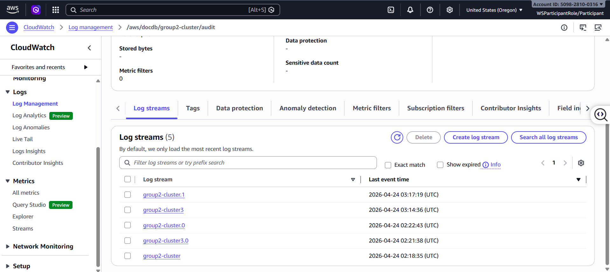

# W3 Evidence Pack  
**File:** docs/W3_evidence.md

---

# Cover

- Group Number: 02
- Member Names: 
  - Ngô Hữu Tài
  - Đặng Thị Ngọc Thảo
  - Nguyễn Hưng Thịnh
  - Nguyễn Phú Triệu
  - Nguyễn Văn Tuấn Anh
  - Lê Hoàng Việt
  - Hoàng Công Trí Dũng
  - Huỳnh Bá Huân
  - Nguyễn Tiến Hoàng Thịnh
  - Mai Phước Khoa
- Project Name: Car Ecommerce
- Chosen Database Path:
  - Engine: Amazon DocumentDB
  - Paradigm: Document Database
- GitHub Repository Link: https://github.com/DangThao195/w3
- Domain web: https://nvtank.dev/ 

---

# 1. W2 Recap

## 1.1 Existing Resources Verified

- S3 Block Public Access: Enabled Block ALL Public Access for all S3 buckets (static and upload) to prevent unintended public exposure and misconfiguration risks.
- S3 Encryption: Enabled encryption at rest (SSE-S3) for all buckets to ensure data is securely stored.
- S3 Versioning: Enabled versioning for the upload bucket to support rollback in case of deployment errors or accidental overwrites.
- IAM MFA: Enabled Multi-Factor Authentication (MFA) for critical IAM users, especially administrators, to enhance account security.
- IAM Users: Reviewed IAM users to ensure no daily operations use the root account, and all users follow the principle of least privilege.
- Admin Group: Created an Admin group with appropriate administrative permissions, avoiding direct permission assignment to individual users.
- Existing VPC Reused: Reused a well-architected VPC setup including:
   - Public subnet + Internet Gateway (for internet-facing resources)
   - Private subnet + NAT Gateway (for secure outbound access)
   - S3 VPC Endpoint allowing private subnet access to S3 without NAT
   - Multi-AZ deployment (2a, 2b) for high availability

## 1.2 W2 Feedback Fixed

- Feedback Item:
    - Risk of S3 buckets being publicly accessible
    - Inefficient cost usage due to NAT Gateway for S3 access
    - Overly permissive IAM policies (e.g., s3:* or *)
    - Lack of controlled access between CloudFront and S3
    - Missing security and performance best practices
- How W3 Improved It:
    - Enforced Block ALL Public Access and removed any "Principal": "*" from bucket policies → ensuring S3 remains private
    - Implemented CloudFront with Origin Access Control (OAC) → only CloudFront can access S3
    - Added S3 VPC Endpoint → eliminates NAT usage for S3 access, reducing cost and improving security
    - Refined IAM policies using least privilege → application role only allows PutObject and GetObject
    - Enforced HTTPS-only access with HTTP → HTTPS redirection via CloudFront → securing data in transit
    - Applied Lifecycle rules → automatic storage optimization and cost reduction
    - Designed Multi-AZ architecture → improved system availability and fault tolerance
    - Verified security by testing direct S3 access → confirmed Access Denied response

## Screenshot

---

# 2. Data Access Pattern Log

## Part A – Real Access Patterns

### Pattern 1

- Description: Retrieve all orders of a specific user when they access the order history page, sorted by newest first. This allows users to track recent deposits, purchases, rentals, payment status, and order progress.
- Estimated Frequency: ~60 requests per minute at peak.

### Pattern 2

- Description: Search for available cars based on location, availability status, and price range, with results sorted by lowest price first. This is the core user-facing search functionality affecting buying decisions.
- Estimated Frequency: ~120 requests per minute at peak.

### Pattern 3

- Description: Admin dashboard queries to aggregate statistics such as number of cars by status (AVAILABLE, SOLD, RESERVED), average price, and order status distribution for business monitoring.
- Estimated Frequency: ~20 requests per minute at peak.

---

## Part B – Engine Choice + Why

### Pattern 1

- Engine: Amazon DocumentDB
- Paradigm: Document Database
- Query Method: find() with filter on user_id, sorted by order_date DESC, with limit
- Index / PK / GSI: Compound index: { user_id: 1, order_date: -1 }
- Why Efficient: The query filters by user_id and sorts by order_date using the same index, avoiding full collection scans. The limit reduces I/O and improves response time.

### Pattern 2

- Engine: Amazon DocumentDB
- Paradigm: Document Database
- Query Method: find() with filters on location_id, status, and price range ($gte, $lte), sorted by daily_price ASC
- Index / PK / GSI: Compound index: { location_id: 1, status: 1, daily_price: 1 }
- Why Efficient: The query leverages a compound index that supports filtering and sorting simultaneously. It avoids scanning the entire collection and ensures fast retrieval for high-frequency search operations.

### Pattern 3

- Engine: Amazon DocumentDB
- Paradigm: Document Database
- Query Method: Aggregation pipeline using $group and $avg
- Index / PK / GSI: Index on { status: 1 }
- Why Efficient: Aggregation is executed directly in the database, reducing data transfer to the backend. Indexing the status field improves grouping performance.

## Self-hosted Only

- Backup Plan: Not applicable (managed service). If self-hosted, would require scheduled backups and snapshot automation.
- HA Plan: Not applicable (managed service). If self-hosted, would require replica set configuration and failover handling.
- Trade-off Reasoning: Using a managed service eliminates operational overhead such as patching, backup management, and replica maintenance, at the cost of higher pricing.

## High Cost Engine Only

- Rough Monthly Cost: Approximately $250 – $400/month for a small cluster (1 writer + 1 replica), depending on instance size, storage, and I/O.
- Why Chosen: Chosen for its managed nature, high availability (Multi-AZ), automatic backups, scalability, and compatibility with MongoDB workloads, which significantly reduces operational complexity and production risk.
 
---

## Part C – Wrong Paradigm Test

- Selected Pattern: Pattern 2 – Search available cars by location + price
- Wrong Database Type: Relational Database (RDBMS)
- What Would Break: Data would be normalized across multiple tables (cars, images, features, etc.), requiring multiple JOIN operations to assemble full car information for each query.
- Why Costly / Slow: Complex JOINs combined with dynamic filters (location, price, status) increase query planning complexity and execution time. At high traffic, this leads to slower response times and scaling challenges compared to a document database where all relevant data resides in a single document and is efficiently indexed.

---

# 3. Deployment Evidence – Database Layer

## 3.1 Database Overview

- Engine: Amazon DocumentDB (MongoDB-compatible)
- Region: us-west-2
- Private Subnet: Deployed in private subnets across Multi-AZ (2a, 2b)
- Public Access Disabled: Yes – database is not publicly accessible
- Encryption Enabled: Yes – encryption at rest enabled using AWS-managed or KMS key
- HA Plan: Multi-AZ deployment with automatic failover and replication (primary + replica instances)

### Screenshot

### Notes

- Why configured this way: The database is deployed in private subnets to ensure it is completely isolated from the public internet. Only the backend application (EC2) can access it through Security Groups. Multi-AZ ensures high availability, while encryption protects data at rest. This setup follows AWS best practices for security and reliability.

---

## 3.2 Security Group Rules

- DB SG Name: group2-security-VPC
- Inbound Source: EC2 Backend Security Group (group2-secu-new)
- Port: 27017 (MongoDB / DocumentDB default port)

### Screenshot

---

## 3.3 Working Read / Write Test

### Insert Data

- Command / Method: 
    db.cars.insertOne({
      brand: "Audi",
      car_model: "Q8 e-tron",
      price: 75000,
      body_style: "SUV",
      engine: "Dual electric motor"
    })
- Result:
    {
      acknowledged: true,
      insertedId: ObjectId('69ea45c606b0744ba144ba89')
    }

### Read Data

- Command / Method: db.cars.countDocuments()
- Result: 19

### Screenshot

## 3.4 Cost Control Automation with AWS Budgets

### Components

- **AWS Budgets**
  - Budget Name: `Budget_gr2`
  - Type: Monthly Fixed Budget
  - Amount: `$50`

- **Amazon SNS**
  - Topic Name: `Budget-Alert-Topic`
  - Sends alerts to Email and Lambda

- **AWS Lambda**
  - Function Name: `EnforceBudgetLimit`
  - Triggered by SNS when budget threshold is exceeded

- **AWS IAM**
  - User Group: `Developer`
  - Deny Policy Name: `OverBudgetDenyPolicy`

### Restricted Actions by Policy

- `ec2:RunInstances`
- `rds:CreateDBInstance`
- `ecs:CreateCluster`
- `ecs:RunTask`

### Alert Rule

- Threshold: `Actual Cost > $0.01` (testing)
- Notification Target: `Budget-Alert-Topic`

### Why Use This Solution?

- Prevent unexpected AWS overspending
- Automatically block expensive resource creation
- Send instant alerts to administrators
- Reduce manual monitoring effort
- Improve governance and budget control

### Screenshot

## 3.5 CloudWatch for Log Management

---

# 4. Working Query Evidence

## Query 1 – Aggregation Pipeline

- Pipeline: 
      db.cars.aggregate([
        {
          $group: {
            _id: "$brand",
            totalCars: {$sum:1} 
          }
        }
      ])
- Result:
      { _id: 'Audi', totalCars: 4 },
      { _id: 'Porsche', totalCars: 1 },
      { _id: 'Mercedes', totalCars: 4 },
      { _id: 'Rolls-Royce', totalCars: 1 },
      { _id: 'Toyota', totalCars: 5 },
      { _id: 'Nissan', totalCars: 3 },
      { _id: 'BMW', totalCars: 1 }

## Screenshot

## Query 2 – Indexed Lookup

- Index:
    // Tạo index cho trường car_model
    db.cars.createIndex({ car_model: 1 }, { name: "idx_car_model_search" })

    // Tìm kiếm tài liệu theo car_model
    db.cars.find({ car_model: "Q8 e-tron" })
- Result:
idx_car_model_search
    [
      {
        _id: ObjectId('69ea45c606b0744ba144ba89'),
        brand: 'Audi',
        car_model: 'Q8 e-tron',
        price: 75000,
        body_style: 'SUV',
        engine: 'Dual electric motor'
      }
    ]

## Screenshot

---

# 5. AI / Bedrock Evidence

## 5.1 Knowledge Base Setup

- Knowledge Base Name: myproduct-docs
- Source Bucket: myproduct-docs-s3
- Documents Count: 3
- Sync Status: Complete

### Screenshot

---

## 5.2 Embedding + Vector Store

- Embedding Model: Titan Text Embeddingsv2
- Vector Store: Amazon OpenSearch Serverless

### Screenshot

---

## 5.3 Retrieve API Test

- Method: AWS Lambda (integrated with API Gateway, using Amazon Bedrock Agent Runtime and Bedrock Agent)
- Query: 

    - Chatbot use case:
      Lambda receives a POST request from API Gateway with JSON payload:
            {
              "question": "list cars in your shop?"
            }
      The function extracts the question field and sends it to Bedrock using retrieve_and_generate() with:
            knowledgeBaseId = 8WJMIZAGIK
            modelArn = meta.llama3-70b-instruct-v1:0

    - Knowledge sync use case:
      Lambda reads environment variables:
            KNOWLEDGE_BASE_ID
            DATA_SOURCE_ID
      Then calls:
            start_ingestion_job()
      to trigger document synchronization into the Knowledge Base.

- Response:

    - Chatbot use case:
      Returns a generated answer from Bedrock in JSON format:
          {
            "answer": "Toyota Camry and Ford Everest are two cars listed in the database."
          }

    - Knowledge sync use case:
      Returns ingestion job status:
          {
            "job_id": "xxxx",
            "status": "STARTED"
          }
      Along with HTTP status 200 OK.

### Screenshot

---

# 6. Lambda Evidence

## 6.1 Function Overview

- Function Name: Chatbot-Bedrock (for Q&A) and Sync-Bedrock-KnowledgeBase (for data ingestion)
- Runtime: Python 3.x (using boto3 SDK)
- Trigger Type: 
    - API Gateway (HTTP POST request) for Chatbot
    - Manual invocation for Knowledge Base sync

### Screenshot

---

## 6.2 IAM Least Privilege

- Allowed Actions:
    bedrock:Retrieve
    bedrock:RetrieveAndGenerate
    bedrock:InvokeModel
    bedrock:StartIngestionJob
- Scoped Resources:
    - Knowledge Base:
    arn:aws:bedrock:us-west-2:509828100316:knowledge-base/8WJMIZAGIK
    - Data Source (for ingestion):
    arn:aws:bedrock:us-west-2:509828100316:knowledge-base/8WJMIZAGIK/data-source/509828100316
    - Foundation Model (Llama 3):
    arn:aws:bedrock:us-west-2::foundation-model/meta.llama3-70b-instruct-v1:0

### Screenshot

---

## 6.3 Trigger Working Result

- Trigger Event:
    curl -X POST "https://8m2zzb7e5e.execute-api.us-west-2.amazonaws.com/default/Chatbot-Bedrock" \
    -H "Content-Type: application/json" \
    -d '{"question": "list cars in your shop?"}'
- Output:
    {
      "answer": "Toyota Camry and Ford Everest are two cars listed in the database."
    }
- CloudWatch Timestamp: 2026-04-23T16:14:08.899Z

### Screenshot

---

# 7. VPC + Networking Evidence

## 7.1 3-Tier Diagram

- Public Tier:
    - Internet Gateway (IGW)
    - Public Subnets (Multi-AZ: 2a, 2b)
    - NAT Gateway (for outbound internet access from - private subnets)
- Private App Tier:
    - Application services (e.g., backend APIs, Lambda or EC2 if used)
    - Deployed in private subnets (no public IP)
    - Access internet via NAT Gateway
    - Access S3 securely via S3 VPC Endpoint (no internet required)
    - Communicates with frontend through API Gateway / CloudFront
- Private DB Tier:
    - Amazon DocumentDB cluster (or database layer)
    - Deployed in private subnets across Multi-AZ (2a, 2b)
    - No public access (fully isolated)
    - Only accessible from App Tier via internal VPC networking
    - Secured using Security Groups and subnet isolation

## Diagram

---

## 7.2 S3 Gateway Endpoint

- Endpoint Name: group2-vpce-s3
- Route Table Attached:
      group2-rtb-private1-us-west-2a
      group2-rtb-private4-us-west-2b
      group2-rtb-private2-us-west-2b
      group2-rtb-private3-us-west-2a

### Screenshot

---

## 7.3 Security Group Reference

- SG Source:
      - ALB Security Group (group2-alb-sg)
      - EC2 Backend Security Group (group2-secu-new)
      - DocumentDB Security Group (group2-security-VPC)

### Screenshot

---

## 7.4 NACL Use Case

- Scenario: Protect the VPC from unwanted or malicious traffic at the subnet level, especially for public-facing subnets.
- Why NACL better here:
      - Stateless control: Allows explicit allow/deny rules for both inbound and outbound traffic → useful for quickly blocking malicious IPs.
      - Subnet-level protection: Applies to all resources in the subnet → adds an extra security layer beyond Security Groups.
      - Explicit deny rules: Unlike Security Groups, NACLs support DENY, which is critical for blacklisting IP ranges.
      - Defense in depth: Works together with Security Groups to provide layered security (NACL = coarse-grained, SG = fine-grained).

---

# 8. Negative Security Test

## Unauthorized Access Attempt

- Test Scenario: Attempted to connect to the DocumentDB cluster endpoint without proper authorization or required network access permissions using the nc command.
- Expected Result: The connection should be denied or blocked due to missing authentication credentials or restrictive security group rules.
- Actual Result: The connection attempt failed with a timeout error (TIMEOUT), indicating that access to the cluster endpoint is not allowed from the current source.

### Screenshot

---
